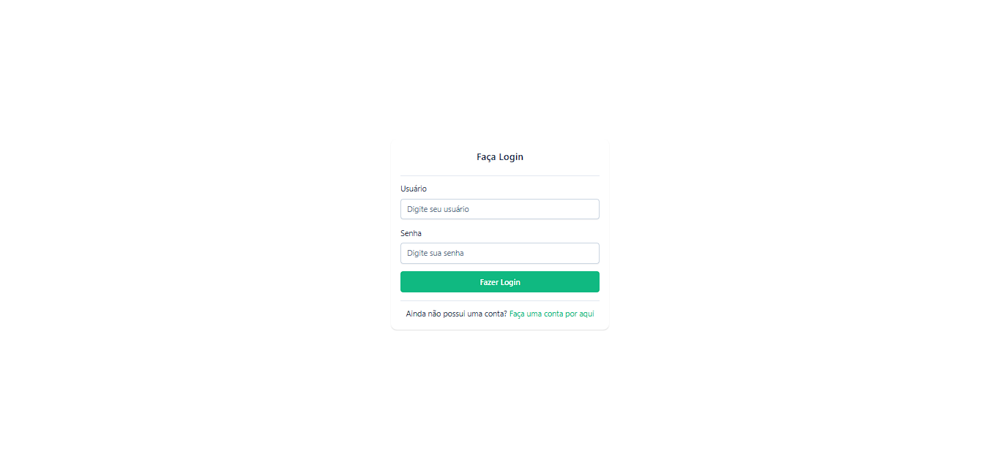
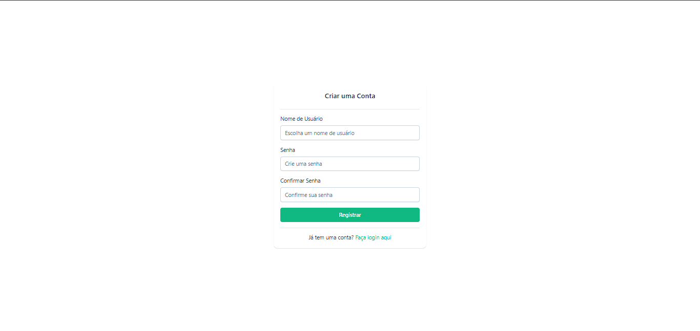
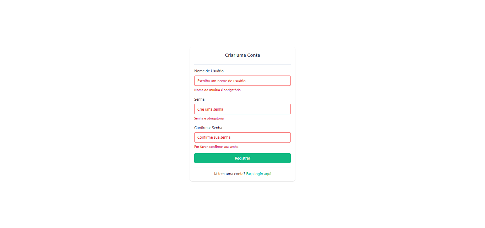
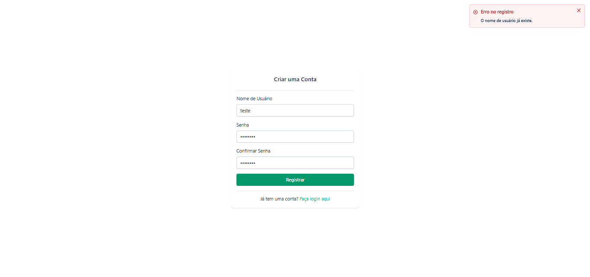
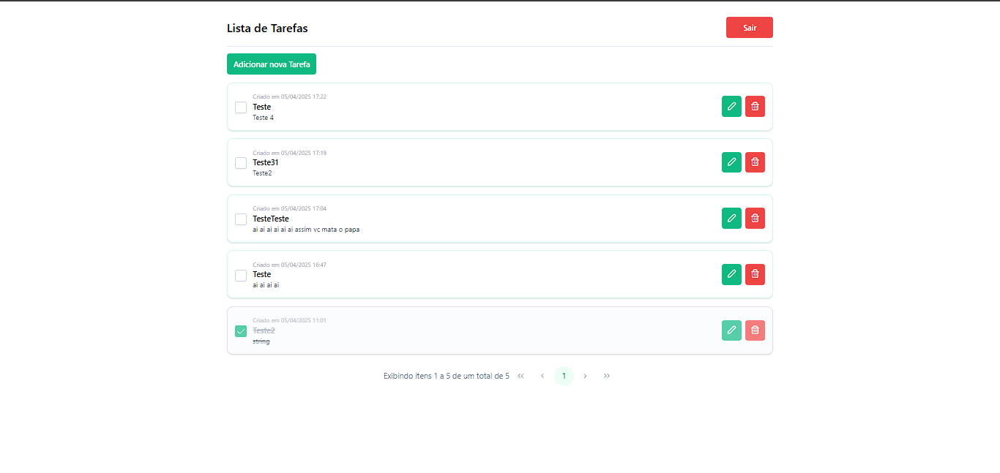
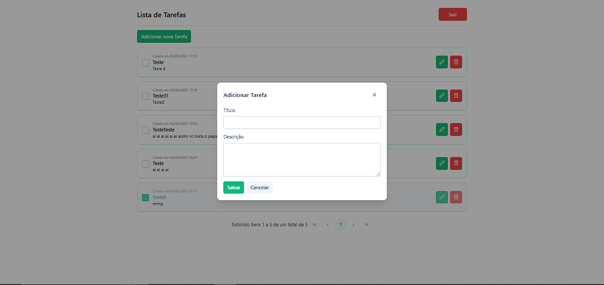
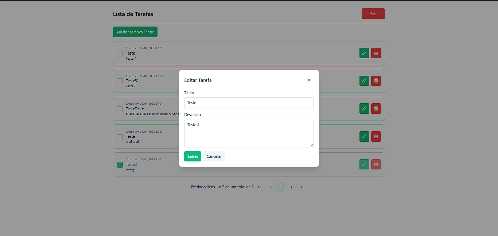
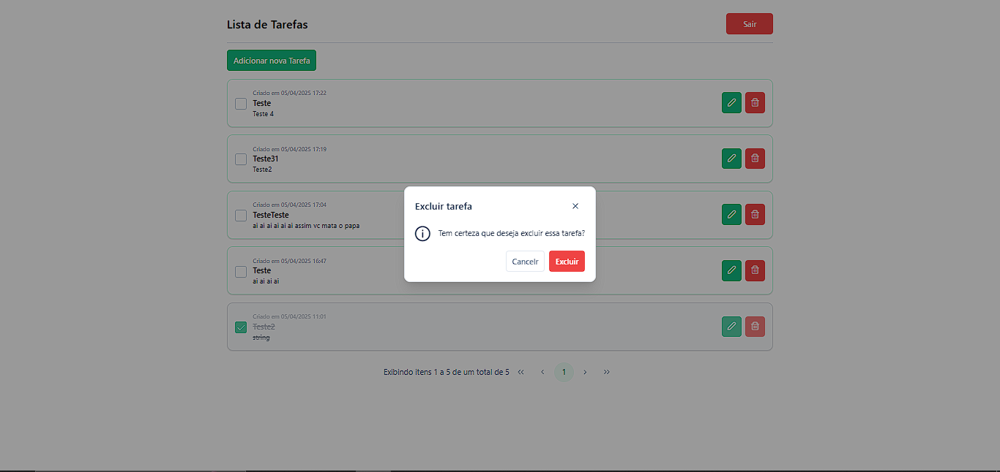

# SimpleTodoFront

Projeto desenvolvido para registro simples de tarefas (to-do) com autenticação. O projeto utiliza a [API](https://github.com/vinii-dev/SimpleTodo), na qual foi desenvolvida com ASP.NET Core WebApi.

Os componentes do projeto foram criados utilizando a biblioteca [PrimeNG](https://primeng.org/) para maior agilidade no desenvolvimento.
## Rodando localmente

> [!NOTE]
> Certifique-se de deixar a API rodando antes de rodar o projeto.

Clone o projeto

```bash
  git clone https://link-para-o-projeto
```

Entre no diretório do projeto

```bash
  cd my-project
```

Instale as dependências

```bash
  npm install
```

Inicie o servidor

```bash
  npm run start
```


## Estrutura do Projeto


```bash
├─ public                     # Arquivos públicos acessíveis diretamente (como ícones, imagens, etc)
├─ src                        
│  ├─ app                     
│  │  ├─ core                 # Módulo com funcionalidades centrais, usadas em toda a aplicação
│  │  │  ├─ auth              # Lógica de autenticação (login, token, guards etc.)
│  │  │  ├─ interceptors      # Interceptadores HTTP (como adicionar headers, tratamento de erros)
│  │  │  └─ models            # Definição de interfaces e modelos de dados usados na aplicação
│  │  ├─ features             # Módulo com funcionalidades específicas por domínio (ex: todo, auth)
│  │  ├─ shared               # Módulo com componentes, pipes, constantes e serviços reutilizáveis
│  │  ├─ app.component.html   
│  │  ├─ app.component.scss   
│  │  ├─ app.component.ts     
│  │  ├─ app.config.ts        
│  │  └─ app.routes.ts        
│  ├─ environment             
│  │  └─ environment.ts       # Configuração de variáveis de ambiente (atualmente utilizado para salvar a base url da API)
│  ├─ index.html              
│  ├─ main.ts                 
│  └─ styles.css
```

### Utilização de Facade Pattern
No projeto é utilizado Facade Patter, um padrão usado para isolar a lógica de acesso a dados e estado em um serviço intermediário (facade), deixando os componentes mais simples.  
O componente não acessa diretamente os serviços — ele consome apenas os observables e métodos expostos pelo facade.


## Screenshots

## Screenshots

<details>
  <summary>Página de Login</summary>
  
</details>

<details>
  <summary>Página de Cadastro</summary>
  
</details>

<details>
  <summary>Validação de campos</summary>
  
</details>

<details>
  <summary>Toast para errors</summary>
  
</details>

<details>
  <summary>Página de listagem de tarefas</summary>
  
</details>

<details>
  <summary>Modal para adição de tarefa</summary>
  
</details>

<details>
  <summary>️Modal para edição de tarefa</summary>
  
</details>

<details>
  <summary>Dialog para confirmação</summary>
  
</details>


## Principais Bibliotecas Utilizadas

- [**Angular**](https://angular.io/) - Framework utilizado para o desenvolvimento do site.

- [**Tailwind CSS**](https://tailwindcss.com) - Framework utilitário de CSS para construção de interfaces com classes pré-definidas, permitindo maior produtividade e controle.

- [**PrimeNG**](https://primeng.org/) - Biblioteca de componentes visuais compatível com Angular, que fornece elementos prontos como tabelas, botões, modais, entre outros.

- [**Jest**](https://jestjs.io/) - Framework de testes utilizado para testes unitários.
